# STM32_WiFiFan
STM32F103ZET6基于Arduino开发的WIFI智能远程风扇

硬件：STM32F103ZET6开发板、ESP8266开发板、DHT11温湿度传感器、L9110电机、按钮、有源蜂鸣器

软件：Blinker、Arduino

用到的库（需要额外添加）：Blinker.h（点灯科技官网下载）、DHT11.h（用到的库文件夹里面）

需要在Arduino附加开发板管理器网址：

https://raw.githubusercontent.com/stm32duino/BoardManagerFiles/main/package_stmicroelectronics_index.json

https://arduino.esp8266.com/stable/package_esp8266com_index.json

Blinker界面配置：

{¨config¨{¨headerColor¨¨transparent¨¨headerStyle¨¨dark¨¨background¨{¨img¨¨assets/img/bg/f2.jpg¨¨isFull¨»}}¨dashboard¨|{¨type¨¨btn¨¨ico¨¨fad fa-power-off¨¨mode¨É¨t0¨¨开关¨¨t1¨¨文本2¨¨bg¨É¨cols¨Í¨rows¨Í¨key¨¨btn-pwr¨´x´É´y´Ð¨speech¨|÷¨lstyle¨Ë¨clr¨¨#595959¨}{ßAßBßC¨fad fa-redo-alt¨ßEÉßF¨顺时针¨ßHßIßJÉßKÍßLÍßM¨btn-dir¨´x´Í´y´ÐßO|÷ßQßRßPË}{ßA¨ran¨ßF¨风速¨ßQ¨#076EEF¨¨max¨¢47¨min¨ÉßJÉßKÑßLËßM¨ran-wen¨´x´É´y´¤DßO|÷ßPË}{ßA¨deb¨ßEÉßJÉßKÑßLÍßM¨debug¨´x´É´y´ÊßO|÷ßPÊ}{ßA¨num¨ßF¨温度¨ßC¨fal fa-question¨ßQ¨#389BEE¨ßZÉßY¢1c¨uni¨´℃´ßJÉßKÍßLËßM¨num-temp¨´x´É´y´¤BßO|÷ßPË}{ßAßdßF¨湿度¨ßCßfßQßgßZÉßYº1ßh´％´ßJÉßKÍßLËßM¨num-humid¨´x´Í´y´¤BßO|÷ßPË}{ßA¨inp¨ßJÉßKÑßLËßM¨inp-hjk¨´x´É´y´ÎßO|÷}÷}

目 录

[1 引言 1](#1-引言)

[2 需求分析 1](#2-需求分析)

[2.1 需求说明 1](#21-需求说明)

[2.2 需求分析 1](#22-需求分析)

[3 系统设计 2](#3-系统设计)

[3.1 体系结构 2](#31-体系结构)

[3.2 硬件设计 3](#32-硬件设计)

[3.2.1 关键部分 3](#321-关键部分)

[3.3 软件设计 5](#33-软件设计)

[3.3.1 关键模块或任务 8](#331-关键模块或任务)

[3.4 控制算法设计 11](#34-算法设计)

[3.4.1 关键的计算模型或算法设计 11](#341-关键的计算模型或算法设计)

[4 系统实现 12](#4-系统实现)

[4.1 关键功能实现 12](#41-关键功能实现)

[5 系统测试 14](#5-系统测试)

[5.1 关键功能测试 14](#51-关键功能测试)

[6 总结 14](#6-总结)

## 1 引言

## 传统电风扇还是有许多地方应当进行改良的，最突出的缺点是它不能根据温度的变化适时调节风力大小，鉴于以上方面的考虑，我们需要设计一种智能电风扇控制系统来解决这些问题。本文通过在现有电动风扇上加装基于Wifi控制的自动系统，设计了一款智能调节与控制的电动风扇。该系统通过温度传感器检测室内温度来开关并自动调节电动风扇的速度，利用Wifi控制提高电动风扇使用的便捷性，实现节能环保。本系统设计简单，实用性强，具有一定的应用价值。

## 2 需求分析

### 2.1 需求说明

功能性：根据空气温湿度和用户设定的参数自动控制风扇工作；可远程手动控制风扇的启停、转速和转向；用蜂鸣器发出提示声。

非功能性：保证隔一段时间更新温度和湿度，并有可视化显示；远程可通过手机的按钮工作

### 2.2 需求分析

通信原理图：

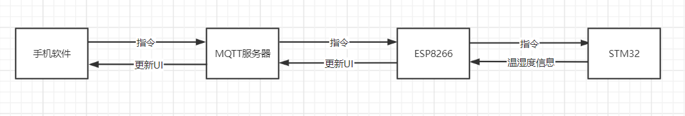

UML图：

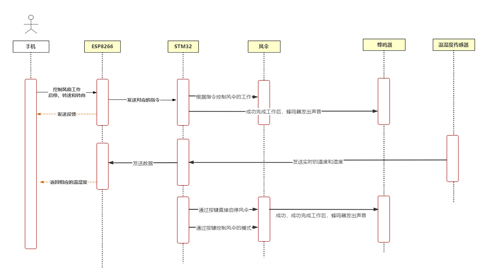

## 3 系统设计

### 3.1 体系结构

在该系统中，通过手机对ESP8266发送控制风扇指令，ESP8266把指令传到STM32，STM32执行指令并反馈，同时每隔一段时间把温湿度的数据传回给ESP8266，ESP8266再传到手机更新温湿度显示信息

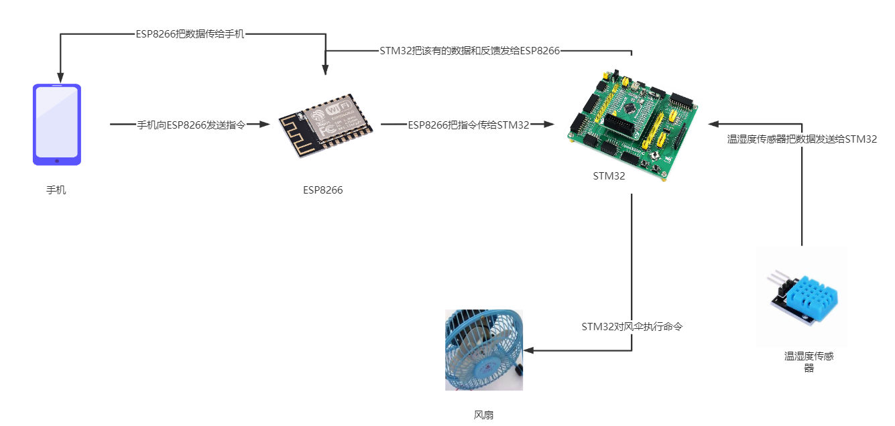

### 3.2 硬件设计

介绍硬件的整体设计方案，画出硬件结构块图。

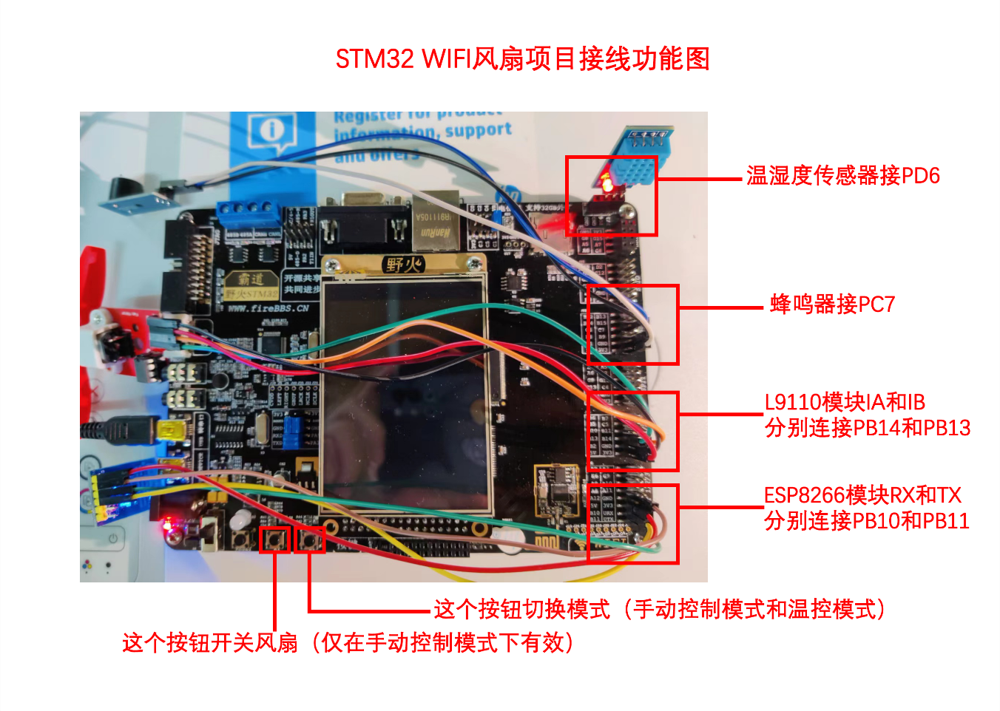

### 3.2.1 关键部分

ESP8266

ESP8266EX 由乐鑫公司开发，提供了一套高度集成的 Wi-Fi SoC 解决方案，其低功耗、紧凑设计和高稳定性可以满足用户的需求。

ESP8266EX 拥有完整的且自成体系的 Wi-Fi 网络功能，既能够独立应用，也可以作为从机搭于其它主机 MCU 运行。

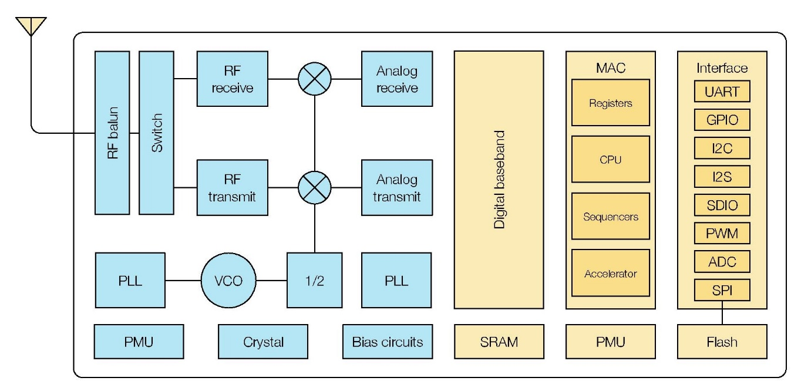

连接说明

模块使用 3.3 ～ 5V 供电，VCC 引脚连接 5V，GND 引脚接地。模块的 RXD 与开发板的 TXD

连接，相反，模块的 TXD 与开发板的 RXD 连接，形成交叉连接的方式。连接原理如图所示。

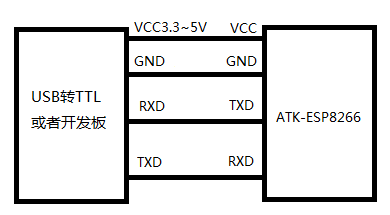

### 3.3 软件设计

软件分为三个模块

一：STM32通过开发板直接控制风扇的开关，同时手机能远程看见温湿度的数据；用蜂鸣器发出提示声。

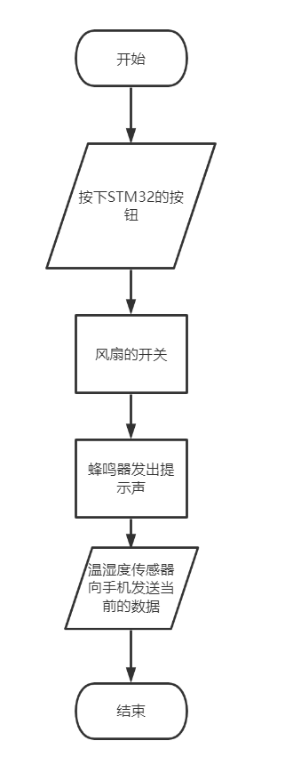

二：风扇的模式为温度控制模式，手机只能远程通过修改温度的阈值，当前温度如果大于温度的阈值，风扇自动开启，小于时风扇自动关闭，同时手机能远程看见温湿度的数据；用蜂鸣器发出提示声。

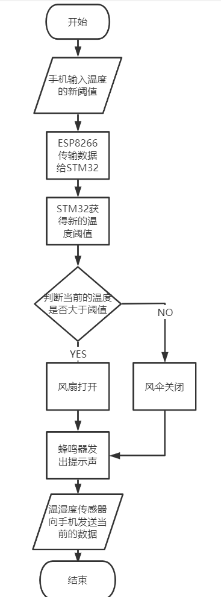

三：风扇的模式为手动控制开关时，手机可以远程向ESP8266发送指令，ESP8266向STM32传送指令，STM32处理并分析指令后，执行指令，控制风扇的启停、转速和转向，同时手机能远程看见温湿度的数据；用蜂鸣器发出提示声。

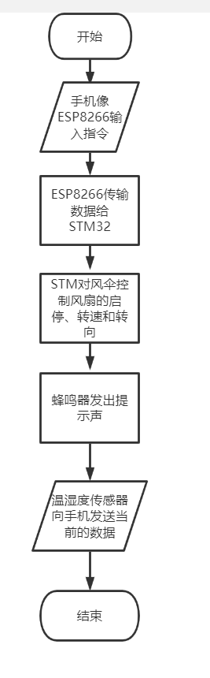

### 3.3.1 关键模块或任务

关键模块介绍：

共分为5个模块，分别为开关风扇功能模块，温度阈值开关功能模块，风速风向调节模块，输入框指令控制模块，温湿度实时监测并显示模块

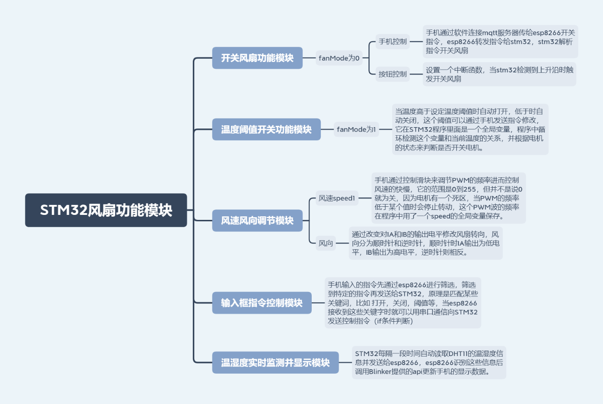

Blinker平台介绍

blinker是一个物联网接入方案，blinker是一套专业且快捷的、跨硬件、跨平台的物联网解决方案，提供APP端、设备端、服务器端支持，使用公有云服务进行数据传输存储，旨在让大家可以轻松畅快地DIY物联网设备。能够快速开发物联网 / 智能家居 / 无线遥控项目。

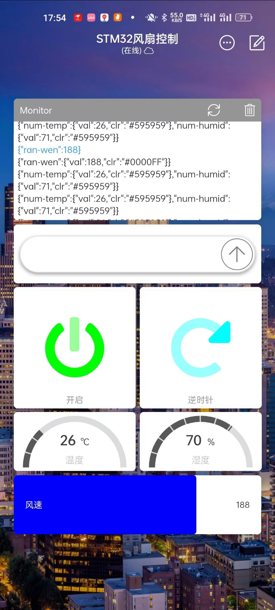

Blinker控制界面（Ui为自己设置）

MQTT

MQTT是一个基于客户端-服务器的消息发布/订阅传输协议。MQTT协议是轻量、简单、开放和易于实现的，这些特点使它适用范围非常广泛。

基本特点

MQTT是一种发布/订阅传输协议，基本原理和实现如下；

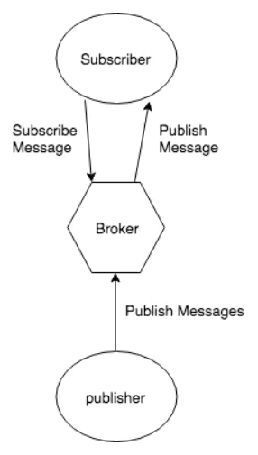

MQTT 协议提供一对多的消息发布，可以解除应用程序耦合，信息冗余小。该协议需要客户端和服务端，而协议中主要有三种身份：发布者（Publisher）、代理（Broker，服务器）、订阅者（Subscriber）。其中，消息的发布者和订阅者都是客户端，消息代理是服务器，而消息发布者可以同时是订阅者，实现了生产者与消费者的脱耦。

使用 TCP/IP 提供网络连接，提供有序、无损、双向连接；

MQTT 是一种连接协议，它指定了如何组织数据字节并通过 TCP/IP 网络传输它们。设备联网，也需要连接到互联网中，在大万维的世界中，TCP 如同汽车，有轮子就能用来运输数据，MQTT 就像是交通规则。在网络模型中，TCP是传输层协议，而 MQTT是在应用层，在 TCP 的上层，因此 MQTT 也是基于这个而构建的，提高了可靠性。

对负载内容屏蔽的消息传输；

可以对消息订阅者所接受到的内容有所屏蔽。

具体有三种消息发布的服务质量：

至多一次，消息发布完全依赖底层 TCP/IP 网络。会发生消息丢失或重复。这一级别可用于如下情况，环境传感器数据，丢失一次读记录无所谓，因为不久后还会有第二次发送。

至少一次，确保消息到达，但消息重复可能会发生。

只有一次，确保消息到达一次。这一级别可用于如下情况，在计费系统中，消息重复或丢失会导致不正确的结果。

小型传输，开销小，固定长度的头部是 2 字节，协议交换最小化，以降低网络流量；

### 3.4 算法设计

### 3.4.1 关键的计算模型或算法设计

风扇状态改变判定：

当有新的指令，如开关风扇，调节风速，调节风向等指令到来时，需要将全局变量isChange置为true，这样在主循环中就可以检测到有状态改变信号的到来，然后根据状态改变后各个参数的变化更新风扇状态，比如开关模式fanMode，如果收到指令修改为1，则转为根据温度自动开关模式，此时温度大于阈值就会启动风扇转动，无法通过手动关闭；为0则表示手动开关模式，需通过手动控制开关或手机控制开关。如果不设置isChange，系统会一直循环进入某个状态对应的函数，然后蜂鸣器一直叫。当更新完状态后将isChange置false，等待下一次状态修改指令。

## 4 系统实现

### 4.1 关键功能实现

Arduino IDE

本项目采用Arduino IDE开发，在Arduino IDE中下载STM32开发板，ESP8266开发板，并安装调用了DHT11库，ESP8266WiFi库，Blinker库

ESP8266WiFi库

应用于ESP8266开发板，负责将ESP8266连接到WiFi，并设置网络配置，使ESP8266能连接互联网。

Blinker库

应用于ESP8266开发板，负责接收手机Blinker发来的各种指令，比如开关，调节风速等，每次接收都会调用一个回调函数

DHT11库

应用于STM32开发板，负责将DHT11侦测到的温度数据格式化为摄氏度，湿度数据格式化为百分比。

中断绑定函数attachInterrupt(GPIO口, 中断服务函数, 触发条件)

应用于STM32开发板，GPIO口绑定了模式切换开关按钮PC7，当PC7触发上升沿时调用changModeSW()中断服务函数；fanMode值为0时表示手动开关模式，为1时表示温控模式

// 模式切换中断函数

void changeModeSW() {

isChange = true;

fanMode = !fanMode;

}

开关模式绑定了开关按钮PA0，同样为上升沿触发，此时调用changeSW()中断服务函数，fanNow为0，1，2分别对应关，顺时针转动，逆时针转动

// 开关中断函数（仅在开关控制模式下能手动开关）

void changeSW() {

isChange = true;

if (fanNow == 0) {

// 从关状态改为开状态默认为顺时针

fanNow = 1;

} else {

fanNow = 0;

}

}

## 5 系统测试

### 5.1 关键功能测试

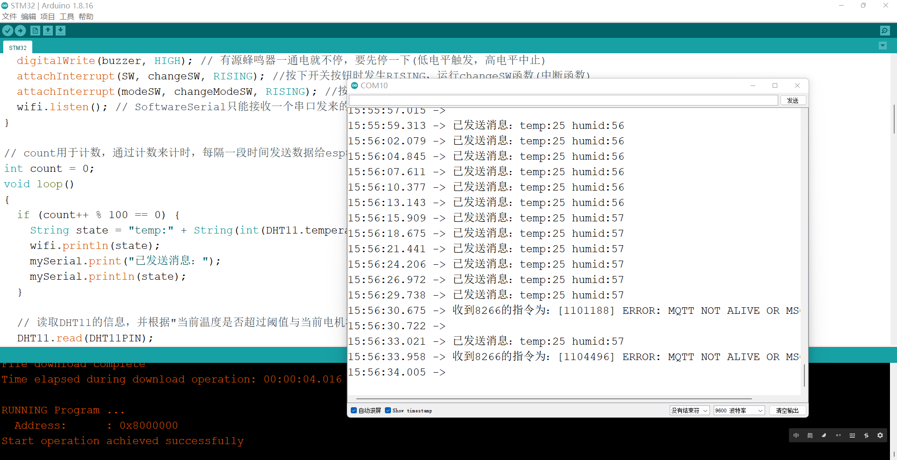

如图，串口中接收来自STM32的数据（即温湿度的数据），

**其他的测试见视频**

## 6 总结

优点：因为是用Blinker的服务，所以可以在家远程操控，用Arduino IDE开发效率明显提升，而且实现的功能更丰富

缺点：Arduino IDE封装的库太多，有问题较难排查。

有待改进：可试试MDK来实现
